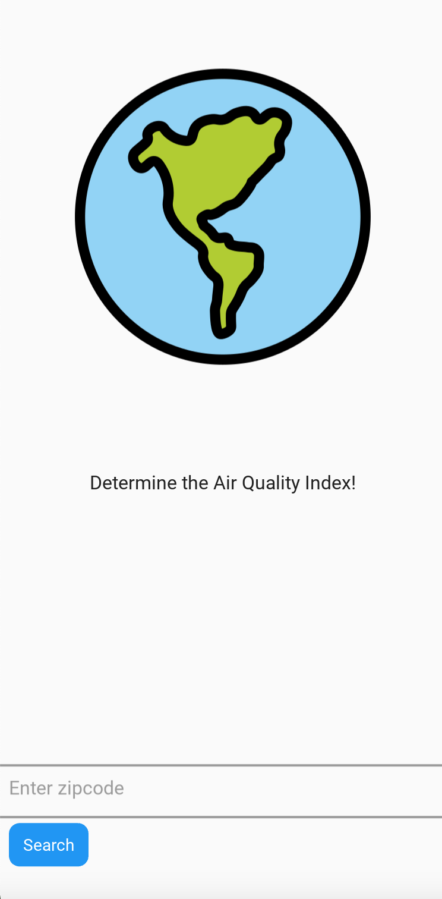
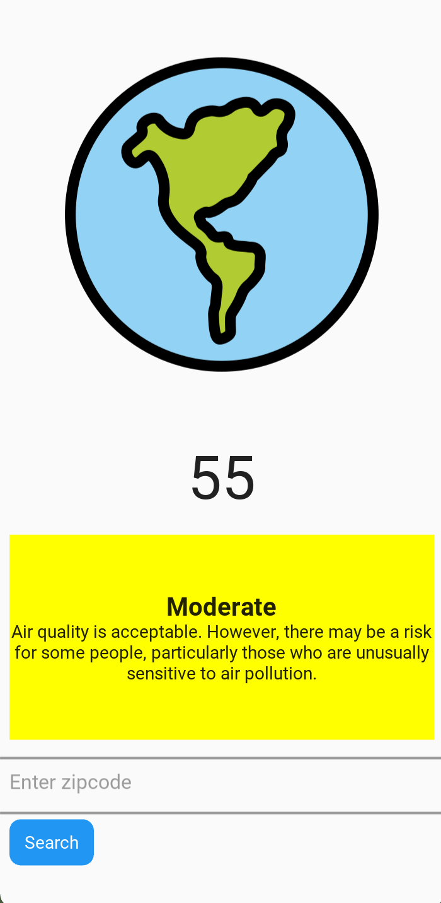
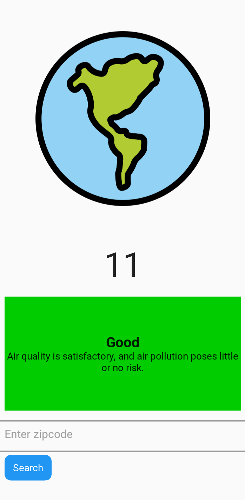

# Air_Quality

A program that uses the [Ziptastic API](https://ziptasticapi.com) to get the air quality index given a zipcode for a location within the United States. As such,
you will need to obtain an API key in order for the program to function correctly. Interpretation of the AQI was obtained from [AirNow](https://www.airnow.gov/aqi/aqi-basics/).
All icons/emojis used are obtained from [OpenMoji](https://openmoji.org).

The KivyMD framework is used to create the GUI. Language used: Python.

